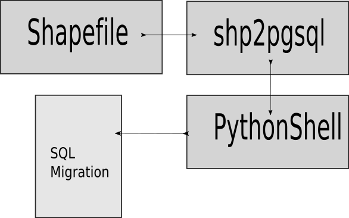

# Shapefiles to Postgis

[by: Alejandro León](https://twitter.com/tutmosisII)

## Descripción

Migración de datos geológicos **shapefile** a postgresql.

## Tecnologías

  - Postgresql 11
  - Posgis 2.4.5
  - Geopandas/python

## Problema

Al migrar algunos archivos **shapefile** con el comando **shp2pgsql** se generarn archivos SQL que tiene problemas con los tipos de datos.

## Solución

## Estructura del Proyecto

El directorio work contiene las carpetas para crear las imagenes de docker para trabajar.

1) Docker con Postgres para probar las migraciones.
